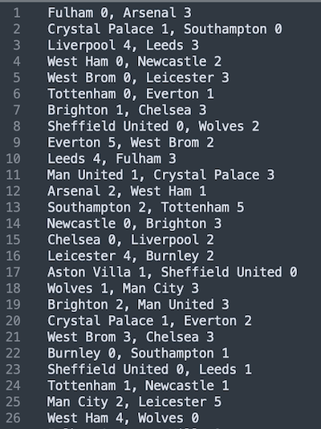

#Span League Ranking Application
The following repo houses the codebase for a production ready, maintainable, testable
command-line application that will calculate the ranking table for a league.

In this repo you will find the Problem Statement PDF with Instructions, the application
codebase and all supporting repository files necessary for the league-ranking python app.

## Tech Stack Details
Following is a full comprehensive list of all the requirements to use and setup this
application accordingly.
### Pre-requisites
When setting up a local environment for developing ensure you are using a local
virtual environment for optimal sand-boxing and testing to minimize clashes with
existing setups or environments on your machine.

####Virtual Environment Setup
######Pyenv
(Recommendation: Use Pyenv where possible to manage your python installations)

Useful pyenv commands: 
`pyenv install --list` - List all pyenv versions on offer 
`pyenv versions` - List pyenv versions on your machine 
`pyenv install <python version>` - Install python version eg. pyenv install 3.8.7 
`pyenv virtualenvs` - List virtualenv versions 
`pyenv virtualenv <python version> <venv-name>` - Create Pyenv Virtual Environment 
`pyenv activate <name>` - Activate Virtual Environment 
`pyenv deactivate` - Exit Virtual Environment 
`pyenv virtualenv-delete <venv-name>` - Delete Virtual Environment 

To note (On Mac): 
Make sure to add the envs to your bash or zsh profiles (.zshrc/.zprofile, .bashrc): 
`export PYENV_ROOT="$HOME/.pyenv"` 
`export PATH="$PYENV_ROOT/bin:$PATH"` 
`eval "$(pyenv init --path)"` 
`eval "$(pyenv init -)"`

###### Standalone virtualenv
`python3 -m pip install --user virtualenv` 
`python3 -m venv env` 
`source ./env/bin/activate`

##### Resources
https://github.com/pyenv/pyenv 
https://github.com/pyenv/pyenv-virtualenv 
*Tutorial* - https://realpython.com/intro-to-pyenv/

### Python Version
This application makes use of Python 3.8.7 
Please ensure you have the correct Python version installed.

### Git Config
In order to ensure that your local git structure mirrors that of the broader style
requirements, you must setup the use of git hooks. This is done via the `pre-commit`
application. If on a Mac, ensure you `brew install pre-commit` (Sometimes you need: `xcode-select --install`)

Run the following configuration in your local repo instance: 
`git config core.hooksPath .githooks`

Make sure all the dev requirements are installed by running: 
`pip install -r dev-requirements.txt`

Make sure all the application requirements are installed by running: 
`pip install -r requirements.txt`

Configure pre-commit
`pre-commit install`

###### Troubleshooting
* Pip - If you're Pip issues not installing packages correctly please take note you may need to upgrade your pip installation:
`pip install --upgrade pip`

###### Common git commands when pushing to repo :* 
* Checkout to new branch:
 * `git checkout -b "feature/<ticket-id>-<short-descriptor>"`
 * eg. `git checkout -b feature/SPAN-101-new-feature`
* Set upstream branch:
 * `git push --set-upstream origin feature/SPAN-101-new-feature`
*Stage all changed files in current directory for commit:
 * `git add .`
* Check status of current branch:
 * `git status`
* Commit changes:
 * `git commit -m "<descriptive-message>"`

*Git Tutorials*:
`https://guides.github.com/activities/hello-world/`

###Environment Variables:
This project makes use of environment variables.
Ensure you have a .env file in your root directory, mimic the .env.template file.
If using passwords or tokens store the passwords and secrets in a vault in the cloud
and reference the value from there in your builds
Also always backup these values on a web application such as lastpass or 1password
(Or any Web Password manager of your choice) 
https://www.lastpass.com/ 
https://1password.com/

## Running the Python Application
### Usage
The Span Index Python file (span_index.py) is the entrypoint for this application. 

Run this python file from your virtual environment (or hosted server with python installed)
with the python commands below: 
* For use with a file input:
 * `python span_index.py --file=<file_path><file_name>`
 * i.e Sample Files to test are stored in ./sample_input
* For use with a command line input as comma and newline seperated text
 * `python span_index.py <cmd input as stringed parameter one match result per line>`

#### Environment Variables
As mentioned above please make sure to add your own Environment Variable file with the
necessary Variables i.e .env
(see .env.template for an example of the env variables used)

To Note: 
Application code resides in the application folder and
testing code resides in the tests folder

### Unit Testing
This Application make use of the Pytest unit testing Library. 
To run the unit tests you can use the single command: 
`pytest` from the root directory of the repo.

For more information and resources on Pytest please see Pytest docs:
https://docs.pytest.org/en/7.2.x/
### Program Inputs and Outputs
* #### Input (Subset of Data in Sample Files Directory) 

* #### Output

* ###### Table Rankings Comparison From Google 

#### IDE's
###### If using an IDE such as Pycharm
Refer to the screenshots below for some Pycharm Configurations
(Similar configurations can be replicated in other editors like vscode, refer to the vendor
for specific setups and configurations)
#### File Input

#### StdIn Input

#### Unit Testing

## *Pending Improvements and Future Updates .....*
### Application Updates:
* Update for different Sports codes (Add configuration in env or via config file for example)
* Create ability to calculate other sports rankings outside of just Football (Soccer).

#### Coding Updates:
* More Detailed Doc String Params
* Type hints
* Update Exception handling to exit more gracefully and send raise errors to the console
* Update logging to output to log files and std out with single logging code statements
* Refactor Score Input Logic and functions into their own helper functions

#### System Updates
* Add Database Integration to store Rankings for future retrieval

#### DeploymentUpdates
* Dockerise Application for use in a containerised environment
* Add deployment scripts to spin application up on a simple VM in the cloud
* Add GitHub checks and analysers to analyse code and run unit tests and analysis on code according to best practices and coding standards
